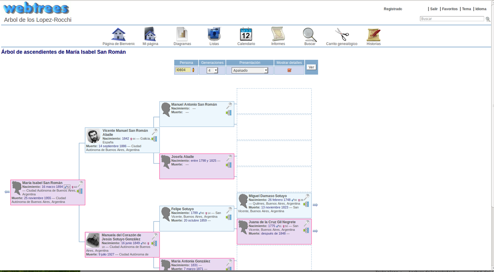

<!--
N.B.: This README was automatically generated by https://github.com/YunoHost/apps/tree/master/tools/README-generator
It shall NOT be edited by hand.
-->

# Webtrees pour YunoHost

[](https://dash.yunohost.org/appci/app/webtrees)  

[](https://install-app.yunohost.org/?app=webtrees)

*[Read this readme in english.](./README.md)*

> *Ce package vous permet d’installer Webtrees rapidement et simplement sur un serveur YunoHost.
Si vous n’avez pas YunoHost, regardez [ici](https://yunohost.org/#/install) pour savoir comment l’installer et en profiter.*

## Vue d’ensemble

Webtrees allows you to view and edit your genealogy on your website. It has full editing capabilities, full privacy functions, and supports imedia such as photos and document images. As an online program, it fosters extended family participation and good ancestral recording habits, as it simplifies the process of collaborating with others working on your family lines. Your latest information is always on your web site and available for others to see, defined by viewing rules you set.

- It works from standard GEDCOM files, and is therefore compatible with every major desktop application.
- It aims to to be efficient and effective by using the right combination of third-party tools, design techniques and open standards.

**Note:** Its better to upgrade from the Webtrees admin panel when new version arrives.


**Version incluse :** 2.1.16~ynh1

**Démo :** https://dev.webtrees.net/demo-stable/index.php?route=%2Fdemo-stable%2Ftree%2Fdemo

## Captures d’écran



## Documentations et ressources

* Site officiel de l’app : <https://www.webtrees.net>
* Documentation officielle de l’admin : <https://wiki.webtrees.net>
* Dépôt de code officiel de l’app : <https://github.com/fisharebest/webtrees>
* Documentation YunoHost pour cette app : <https://yunohost.org/app_webtrees>
* Signaler un bug : <https://github.com/YunoHost-Apps/webtrees_ynh/issues>

## Informations pour les développeurs

Merci de faire vos pull request sur la [branche testing](https://github.com/YunoHost-Apps/webtrees_ynh/tree/testing).

Pour essayer la branche testing, procédez comme suit.

``` bash
sudo yunohost app install https://github.com/YunoHost-Apps/webtrees_ynh/tree/testing --debug
ou
sudo yunohost app upgrade webtrees -u https://github.com/YunoHost-Apps/webtrees_ynh/tree/testing --debug
```

**Plus d’infos sur le packaging d’applications :** <https://yunohost.org/packaging_apps>