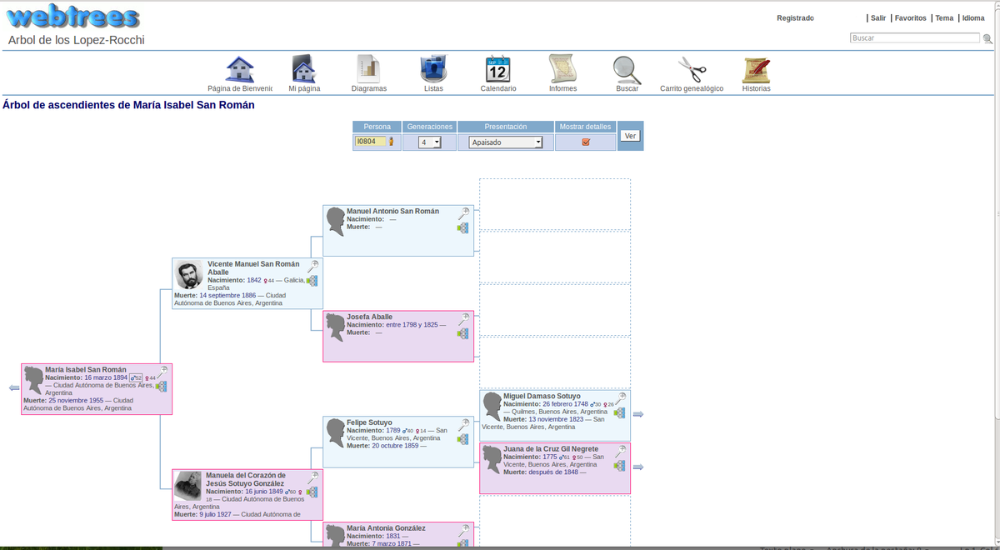

<!--
N.B.: Questo README è stato automaticamente generato da <https://github.com/YunoHost/apps/tree/master/tools/readme_generator>
NON DEVE essere modificato manualmente.
-->

# Webtrees per YunoHost

[](https://dash.yunohost.org/appci/app/webtrees)  

[](https://install-app.yunohost.org/?app=webtrees)

*[Leggi questo README in altre lingue.](./ALL_README.md)*

> *Questo pacchetto ti permette di installare Webtrees su un server YunoHost in modo semplice e veloce.*  
> *Se non hai YunoHost, consulta [la guida](https://yunohost.org/install) per imparare a installarlo.*

## Panoramica

Webtrees allows you to view and edit your genealogy on your website. It has full editing capabilities, full privacy functions, and supports imedia such as photos and document images. As an online program, it fosters extended family participation and good ancestral recording habits, as it simplifies the process of collaborating with others working on your family lines. Your latest information is always on your web site and available for others to see, defined by viewing rules you set.

- It works from standard GEDCOM files, and is therefore compatible with every major desktop application.
- It aims to to be efficient and effective by using the right combination of third-party tools, design techniques and open standards.

**Note:** Its better to upgrade from the Webtrees admin panel when new version arrives.


**Versione pubblicata:** 2.1.18~ynh2

**Prova:** <https://dev.webtrees.net/demo-stable/index.php?route=%2Fdemo-stable%2Ftree%2Fdemo>

## Screenshot



## Documentazione e risorse

- Sito web ufficiale dell’app: <https://www.webtrees.net>
- Documentazione ufficiale per gli amministratori: <https://wiki.webtrees.net>
- Repository upstream del codice dell’app: <https://github.com/fisharebest/webtrees>
- Store di YunoHost: <https://apps.yunohost.org/app/webtrees>
- Segnala un problema: <https://github.com/YunoHost-Apps/webtrees_ynh/issues>

## Informazioni per sviluppatori

Si prega di inviare la tua pull request alla [branch di `testing`](https://github.com/YunoHost-Apps/webtrees_ynh/tree/testing).

Per provare la branch di `testing`, si prega di procedere in questo modo:

```bash
sudo yunohost app install https://github.com/YunoHost-Apps/webtrees_ynh/tree/testing --debug
o
sudo yunohost app upgrade webtrees -u https://github.com/YunoHost-Apps/webtrees_ynh/tree/testing --debug
```

**Maggiori informazioni riguardo il pacchetto di quest’app:** <https://yunohost.org/packaging_apps>
